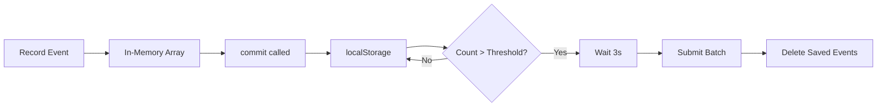

## Automatic batching

Nanolytics automatically batches events to optimize network usage and performance. Instead of sending each event individually, the library accumulates events and submits them in batches.

## Batch threshold

The batching system triggers automatic submission when the number of saved events exceeds a configurable threshold.

### Default limit

By default, automatic submission is triggered when more than **100 events** are stored in localStorage.

### Custom threshold

You can customize this limit when initializing Nanolytics:

```typescript
import { init } from 'nanolytics';

init(submitAnalytics, { 
  maxEventsLimitUntilSubmit: 150 
});
```

<ParamField path="maxEventsLimitUntilSubmit" type="number" default="100">
  Maximum number of events before triggering an automatic submission.
</ParamField>

## Submission trigger

When the library initializes, it checks if saved events exceed the threshold. From `src/index.ts:24`:

```typescript
const savedEvents: Event[] = JSON.parse(localStorage.getItem('events') || '[]');

if (savedEvents.length > (options.maxEventsLimitUntilSubmit || 100)) {
    setTimeout(() => {
        submitFn(getUserInfo(), savedEvents).then(deleteSavedEvents);
    }, 3000); // Delay submission for a smoother experience
}
```

### Submission flow

1. **Check threshold** - On initialization, the library reads saved events from localStorage
2. **Compare count** - If event count exceeds `maxEventsLimitUntilSubmit`, prepare for submission
3. **3-second delay** - Wait 3 seconds before submitting to ensure a smooth user experience
4. **Submit events** - Call your custom `submitFn` with user info and events
5. **Clean up** - After successful submission, delete saved events from localStorage

<Info>
The 3-second delay prevents blocking the main thread during critical initialization moments, ensuring your app loads smoothly.
</Info>

## Performance optimization

Batching provides several performance benefits:

### Reduced network requests

Instead of making an HTTP request for every event, batching combines multiple events into a single request, reducing:
- Network overhead
- Server load
- Battery consumption on mobile devices

### Controlled submission timing

The 3-second delay ensures:
- The app UI loads first
- Critical resources are fetched before analytics
- Users don't experience performance degradation

### Efficient payload size

Sending events in batches allows for:
- Better compression ratios
- Amortized request headers across multiple events
- More efficient bandwidth usage

## Event lifecycle

Here's how events flow through the batching system:



## Manual control

While batching is automatic, you can manually control event persistence and submission:

```typescript
import { commit, getSavedEvents, deleteSavedEvents } from 'nanolytics';

// Manually save current session to localStorage
commit();

// Check saved event count
const events = getSavedEvents();
console.log(`${events.length} events saved`);

// Clear saved events after custom submission
await myCustomSubmit(events);
deleteSavedEvents();
```

<Warning>
If you manually delete saved events, make sure your submission was successful first to avoid data loss.
</Warning>
