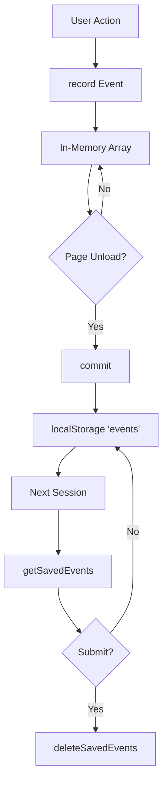

## localStorage persistence

Nanolytics uses the browser's `localStorage` API to persist events across sessions. This ensures that events are not lost if the user closes the browser or navigates away from your application.

## Storage key

All events are stored under a single localStorage key: `'events'`.

From `src/api.ts:64`:

```typescript
localStorage.setItem('events', JSON.stringify([...getSavedEvents(), ...events]));
```

## Reading saved events

The `getSavedEvents()` function retrieves events from localStorage and parses them into an array.

From `src/api.ts:34`:

```typescript
export const getSavedEvents = (): Event[] => JSON.parse(localStorage.getItem('events') || '[]');
```

### Usage example

```typescript
import { getSavedEvents } from 'nanolytics';

const events = getSavedEvents();
console.log(`You have ${events.length} saved events`);
```

<Info>
If no events are saved, `getSavedEvents()` returns an empty array instead of null.
</Info>

## Saving events with commit()

The `commit()` function is the primary way events are persisted to localStorage.

### What commit() does

From `src/api.ts:62`:

```typescript
export const commit = () => {
    record('EndSession');
    localStorage.setItem('events', JSON.stringify([...getSavedEvents(), ...events]));
};
```

1. **Records end session** - Automatically adds an `'EndSession'` event to mark the session boundary
2. **Merges events** - Combines previously saved events with current session events
3. **Persists to storage** - Saves the merged array to localStorage as a JSON string

### Automatic commit on page unload

Nanolytics automatically commits events when the user closes the browser or navigates away.

From `src/index.ts:19`:

```typescript
window.onbeforeunload = commit; // Save events when the window is about to close
```

<Warning>
The `beforeunload` event is not 100% reliable on mobile browsers. For critical events, consider manually calling `commit()` at strategic points in your application.
</Warning>

## Deleting saved events

After successfully submitting events to your analytics backend, you should delete them from localStorage to prevent duplicate submissions.

From `src/api.ts:73`:

```typescript
export const deleteSavedEvents = () => localStorage.removeItem('events');
```

### Automatic cleanup

When events are automatically submitted (when exceeding the batch threshold), they're automatically deleted after successful submission.

From `src/index.ts:28`:

```typescript
submitFn(getUserInfo(), savedEvents).then(deleteSavedEvents);
```

### Manual cleanup

```typescript
import { getSavedEvents, deleteSavedEvents } from 'nanolytics';

const events = getSavedEvents();

try {
  await sendToAnalyticsBackend(events);
  deleteSavedEvents(); // Only delete after successful submission
} catch (error) {
  console.error('Failed to submit events', error);
  // Events remain in localStorage for retry
}
```

## Persistence across sessions

Events stored in localStorage persist across:

- Browser restarts
- Tab closures
- Page refreshes
- Navigation to other sites

This ensures reliable event tracking even with intermittent connectivity or unexpected browser closures.

### Session boundaries

Each session is marked with `'StartSession'` and `'EndSession'` events:

- **StartSession**: Recorded when `init()` is called (from `src/index.ts:22`)
- **EndSession**: Recorded when `commit()` is called

This allows you to analyze user behavior across multiple sessions.

## Storage lifecycle

Here's how events flow through the storage system:



## Storage limits

localStorage has size limitations that vary by browser:

- **Most browsers**: 5-10 MB per origin
- **Mobile Safari**: May be more restrictive

<Note>
With Nanolytics' compact event structure (timestamps in seconds, minimal metadata), you can typically store tens of thousands of events before hitting limits.
</Note>

## Clearing all data

For testing or user privacy features, you may need to clear all stored events:

```typescript
import { deleteSavedEvents, clearEvents } from 'nanolytics';

// Clear localStorage
deleteSavedEvents();

// Clear in-memory events
clearEvents();
```

<Warning>
This permanently deletes event data. Make sure events are submitted first if you need to preserve them.
</Warning>
